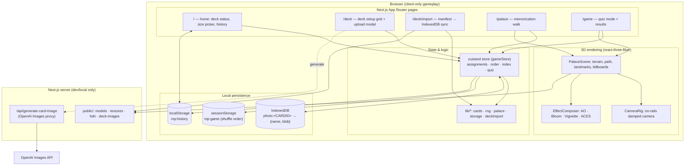
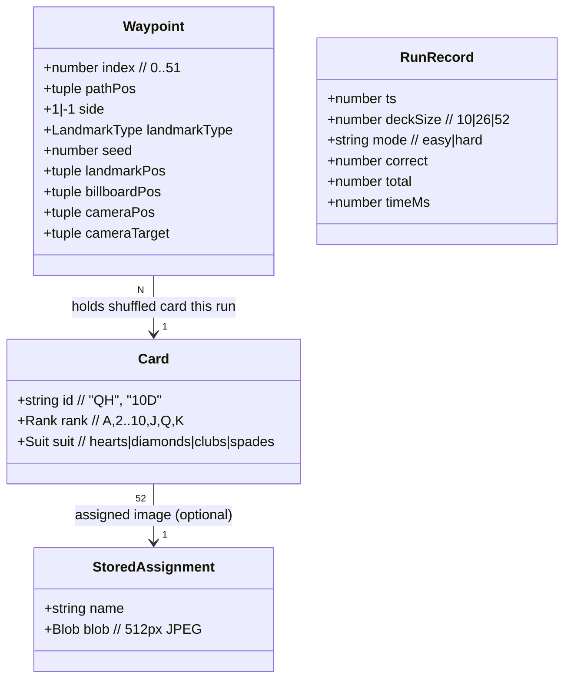
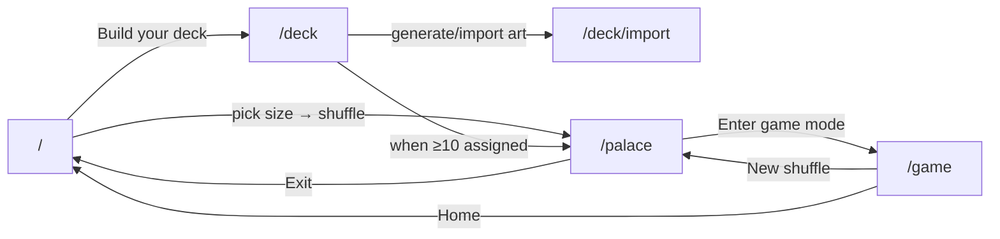
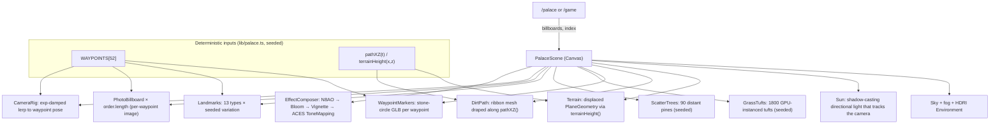
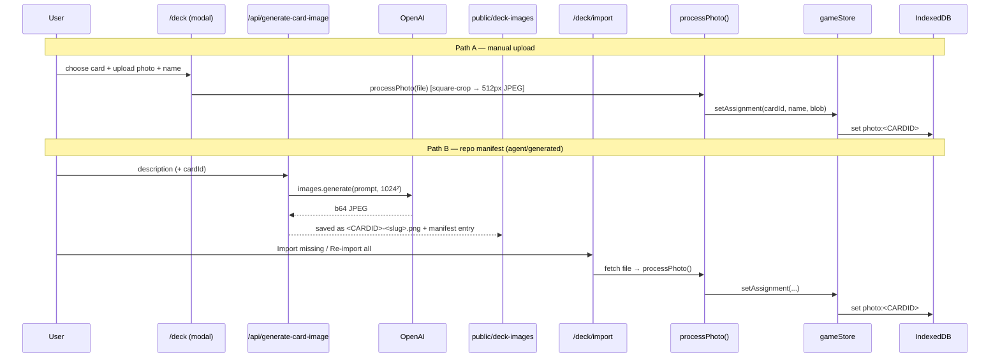
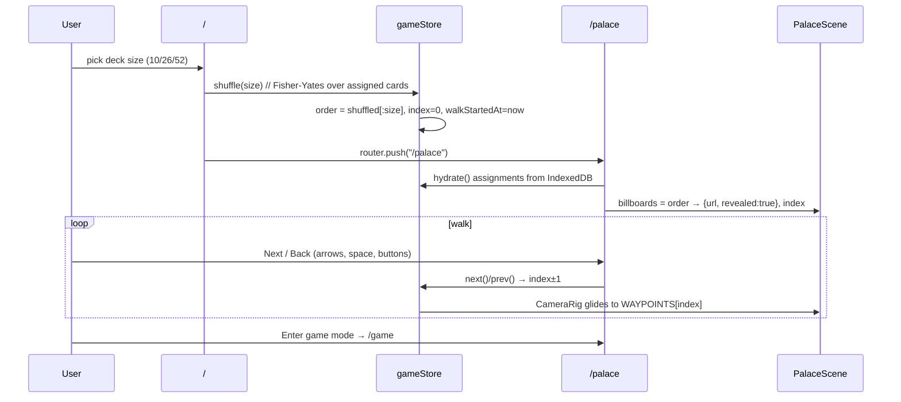
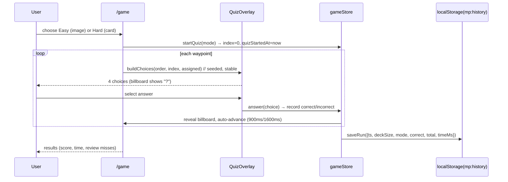

# Memory Palace — Design Document

A single-player web game that teaches and trains the **method of loci** (the
"memory palace" technique) for memorizing the order of a shuffled deck of
playing cards. The player assigns a vivid personal image to each of the 52
cards, shuffles a deck, mentally "walks" a fixed 3D route placing each card's
image at successive stops, then tests recall by walking the route again.

This document describes the architecture as built. For product rationale and
the original scoping, see `PLAN.md`; for the ongoing agent workflow and current
data state, see `HANDOFF.md`.

---

## 1. Design goals & core invariant

| Goal | How it shapes the design |
| --- | --- |
| **Teach a real memory technique** | Mechanics mirror the loci method: personal card→image pairing, a spatial route, stop-by-stop placement, recall-by-walking. |
| **The world is *identical* every visit** | The single most important invariant. Familiarity with the space is the engine of the technique. All terrain, path, landmarks, and camera poses are **deterministically generated from fixed seeds** — nothing depends on `Math.random()`. Only the placed images change per shuffle. |
| **Local-first, zero-friction** | No accounts, no backend for gameplay. Photos live in IndexedDB; run history in `localStorage`; the shuffle in `sessionStorage`. The game works fully offline once loaded. |
| **Fast to load, cheap to store** | User photos are center-cropped square and downscaled to 512px JPEG at ingest, keeping IndexedDB small and 3D textures fast. |

> **The determinism invariant is load-bearing.** Any change that makes the
> landscape, route, or waypoint layout vary between visits breaks the pedagogy.
> Seeds in `lib/palace.ts` are fixed constants and must stay that way.

---

## 2. Technology choices

| Layer | Choice | Rationale |
| --- | --- | --- |
| Framework | **Next.js 16** (App Router, Turbopack) | File-based routing, a colocated API route for image generation, fast dev builds. Note: this is a newer Next.js — consult `node_modules/next/dist/docs/` before relying on remembered APIs. |
| UI runtime | **React 19** | Concurrent rendering, `useSyncExternalStore` for the `localStorage`-backed history snapshot. |
| Language | **TypeScript 5** | Strict typing across the card model, waypoint geometry, and store. |
| Styling | **Tailwind CSS v4** (`@tailwindcss/postcss`) | Utility-first styling for the 2D HUD and menu chrome. |
| 3D engine | **three.js** + **@react-three/fiber** | Declarative React bindings over three.js for the palace scene. |
| 3D helpers | **@react-three/drei** | `Sky`, `Environment` (HDRI), `useTexture`, `useGLTF`, GPU instancing (`Instances`/`Instance`). |
| Post-processing | **@react-three/postprocessing** | N8AO (ambient occlusion), Bloom, Vignette, ACES filmic tone mapping for a polished look. |
| State | **zustand 5** (+ `persist` middleware) | Small, hook-based global store. Only the shuffle is persisted (to `sessionStorage`) so a mid-walk refresh keeps the same deck. |
| Photo storage | **idb-keyval** (IndexedDB) | Blobs are too large for `localStorage`; key/value wrapper keeps the storage code tiny. |
| Run history | **`localStorage`** | Small JSON records; read as a stable snapshot via `useSyncExternalStore`. |
| Image generation | **OpenAI Images API** (`gpt-image-1`) | Server route generates memorable card art from a text prompt. Local/dev only; requires `OPENAI_API_KEY`. |
| Fonts | **Geist / Geist Mono** via `next/font` | Optimized, self-hosted variable fonts. |

---

## 3. High-level architecture



The app is **client-first**: all gameplay runs in the browser with no server
round-trips. The only server-side component is a colocated API route that
proxies OpenAI image generation for building card art — a content-authoring
convenience, not part of the gameplay loop.

---

## 4. Data model

### Cards (`lib/cards.ts`)

The 52-card deck is generated deterministically. Card ids are rank + suit
code, e.g. `"QH"`, `"10D"`, `"AC"`.



### Storage map

| Data | Store | Key / shape | Lifetime |
| --- | --- | --- | --- |
| Card→photo assignments | IndexedDB (`idb-keyval`) | `photo:<CARDID>` → `{ name, blob }` | Persistent |
| Run history | `localStorage` | `mp:history` → `RunRecord[]` (capped at 100) | Persistent |
| Current shuffle | `sessionStorage` (zustand persist) | `mp:game` → `{ order, deckSize, quizMode, walkStartedAt }` | Per browser tab/session |
| Object URLs / quiz progress | in-memory only | — | Per page load |

Object URLs for blobs are created on hydrate and revoked on
replace/remove; they intentionally do **not** survive a reload (only the
shuffle order is persisted, so a mid-walk refresh keeps the same deck but
re-hydrates images from IndexedDB).

---

## 5. Routes & navigation flow



- **`/`** — Home. Shows assigned count (`n / 52`), a deck-size picker (10 / 26 /
  52, gated on ≥10 assigned), best runs per `deckSize+mode`, and recent history.
- **`/deck`** — 52-slot grid; per-card upload / name / remove modal.
- **`/deck/import`** — Syncs `public/deck-images/manifest.json` into IndexedDB
  (the repo-side image pipeline; buttons "Import missing" / "Re-import all").
- **`/palace`** — The memorization walk (3D scene + HUD).
- **`/game`** — Quiz mode (easy/hard picker → 4-choice quiz → results).

All gameplay pages are **client components** (`"use client"`) because they
depend on the 3D canvas and browser storage.

---

## 6. State management (`store/gameStore.ts`)

A single zustand store holds three concerns:

1. **Deck setup** — `assignments` (cardId → `{ name, url }`), hydrated once from
   IndexedDB; `setAssignment` / `removeAssignment` write through to IndexedDB
   and manage object URLs.
2. **Walk / shuffle** — `order` (shuffled cardIds), `deckSize`, `index`
   (current waypoint), `walkStartedAt`; `shuffle(size)` draws from assigned
   cards, `next`/`prev`/`setIndex` move the camera.
3. **Quiz** — `quizMode`, `quizStartedAt/FinishedAt`, `answers` (one per
   waypoint). `answer()` records correctness and, on the final answer, writes a
   `RunRecord` to history.

Only `{ order, deckSize, quizMode, walkStartedAt }` is persisted (to
`sessionStorage` via `partialize`). Assignments and quiz progress are
deliberately transient.

---

## 7. 3D rendering pipeline (`components/palace/`)



Key points:

- **Determinism** — Terrain height, the winding path, and all 52 waypoint poses
  come from pure functions and fixed seeds (`mulberry32(1337)` for waypoints,
  and constant seeds for grass/tree scatter). The scene is byte-for-byte
  identical on every visit.
- **Camera on rails** — `CameraRig` exponentially damps the camera toward the
  current waypoint's `cameraPos`/`cameraTarget` each frame. There is no free
  roam; the player advances stop-to-stop (click, arrow keys, or space).
- **Performance** — Grass is GPU-instanced (1800 tufts from one geometry). The
  shadow-casting sun uses a tight ortho frustum that follows the camera so a
  ~1000-unit-long world still gets crisp shadows near the player.
- **Assets** — GLB models, textures, and the HDRI are served statically from
  `public/` (`/models`, `/textures`, `/hdri`).

---

## 8. Card image pipeline

Two authoring paths converge on the same crop/downscale-and-store pipeline:



- `processPhoto()` (`lib/storage.ts`) is the single ingest chokepoint:
  center-crop to square, downscale to 512px, encode JPEG at quality 0.85.
- The manifest importer (`lib/deckImport.ts`) validates the card id, skips
  already-assigned cards unless `overwrite` is set, and reports per-entry
  status (`imported` / `updated` / `up-to-date` / `error`).

---

## 9. Gameplay flows

### Memorization walk (`/palace`)



### Quiz / scoring (`/game`)



- **Easy mode** shows candidate *images*; **Hard mode** shows candidate *cards*
  (`CardChip`), testing the full card→image→locus chain.
- Distractors are drawn from the whole assigned set (seeded per waypoint so
  choices are stable across re-renders/StrictMode double-invokes).
- Scoring = accuracy + total time. The best run per `deckSize+mode` surfaces on
  the home page; speed is the long-term game.

---

## 10. Non-goals (v1) & future work

Explicitly out of scope for v1 (per `PLAN.md`):

- Accounts and hosted image storage (cross-device sync).
- Multiple environments or a custom route editor.
- Free-roam movement (the on-rails camera is intentional).
- Leaderboards; spaced-repetition drills for the card→image pairings.

Known constraints worth noting for future changes:

- The image-generation route is **local/dev only** (needs `OPENAI_API_KEY`) and
  is not part of the shipped gameplay loop.
- Some third-party characters are blocked by the image-generation content
  filter; those cards require manual upload (see `HANDOFF.md`).
- In easy-mode quiz, choice thumbnails show photo names, which can hint the
  answer for descriptive names — name-hiding is a considered-but-unimplemented
  option.

---

## 11. Repository map

```
app/
  page.tsx                     home: deck status, size picker, history
  deck/page.tsx                deck setup grid + upload modal
  deck/import/page.tsx         manifest → IndexedDB import
  palace/page.tsx              memorization walk
  game/page.tsx                quiz mode + results
  api/generate-card-image/route.ts   OpenAI Images proxy (dev/local)
  layout.tsx, globals.css      root layout, Tailwind
lib/
  cards.ts                     52-card model, labels, suit colors
  rng.ts                       mulberry32 PRNG + Fisher-Yates shuffle/sample
  palace.ts                    terrain fn, path, 52 deterministic waypoints
  storage.ts                   IndexedDB assignments, processPhoto, run history
  deckImport.ts                manifest fetch + per-entry import
  generateImage.ts             client helper for the generate API
store/
  gameStore.ts                 zustand: assignments, shuffle, walk, quiz
components/
  CardChip.tsx                 mini playing-card renderer
  DeckSizePicker.tsx           10/26/52 selector
  deck/DeckSetup.tsx           52-slot grid + upload/name/remove
  game/QuizOverlay.tsx         seeded 4-choice panel + feedback
  palace/PalaceScene.tsx       Canvas: sky, terrain, path, landmarks, post-fx
  palace/Landmarks.tsx         13 landmark types × seeded variation
  palace/PhotoBillboard.tsx    framed billboard ("?" placeholder in quiz)
  palace/CameraRig.tsx         damped camera tween between waypoint poses
  palace/FitModel.tsx          GLB loader that normalizes model scale
  palace/SceneLoader.tsx       loading overlay for the 3D canvas
  palace/Hud.tsx               counter, timer (formatMs), nav pills
public/
  models/ textures/ hdri/      static 3D assets
  deck-images/ + manifest.json repo-side card art + import manifest
```
