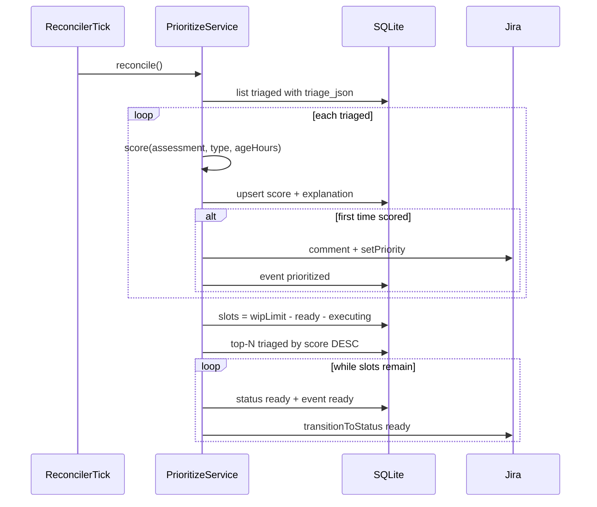

# Phase 3 — Prioritization

Execution contract for Phase 3 of [`docs/workflow/MASTER-PLAN.md`](../workflow/MASTER-PLAN.md). Scope: a tick-driven prioritization service that watches `status='triaged'` tickets (with parsed `TriageAssessment` in `tickets.triage_json`), scores them deterministically, posts score + explanation + Jira Priority to the same ticket, and promotes eligible tickets to **Column 3: Ready for Execution** under `execution.wipLimit`. Exposes `GET /api/queue` for the ranked demo queue. No Cursor SDK, no game-app changes.

Branch: `phase-3-prioritization` cut from latest `main` (Phase 2 merged as `b42d6d9`).

## Design decisions

1. **Tick-driven only (no push trigger).** Promotion depends on global rank + WIP, not a single event. Every reconciler tick (15s) runs prioritization after triage gates.
2. **Pure scorer** `score({ assessment, type, ageHours })` — unit-testable. Type and age come from the `requests` row; assessment fields from `tickets.triage_json`.
3. **Score all `triaged`; promote within WIP.** Every parseable `triaged` ticket gets `score` + `score_explanation` persisted and (once) mirrored to Jira. Transition to `ready` only while `(count ready + count executing) < execution.wipLimit`, highest score first. With `wipLimit: 1`, validation shows one ticket in Ready and the rest held in Triaged.
4. **Idempotent Jira mirror.** First successful score writes a `prioritized` event + one score comment + `setPriority`. Later ticks may refresh SQLite scores (age boost) but do not re-comment. Promotion is a separate `ready` event + `transitionToStatus(..., "ready")`.
5. **WIP counts `ready` + `executing`** against `execution.wipLimit` (backpressure into Column 3 before Phase 4 exists).
6. **Jira Priority** via new `setPriority(issueKey, name)` mapping score bands → `Highest|High|Medium|Low|Lowest`. Numeric score + human-readable explanation live in the comment (and SQLite).
7. **SQLite is source of truth** (Phase 2 stance): local score/`ready` updates even if Jira fails, with an `error` event noting board lag.

## Scoring formula

```
base =
  typeWeight(type)           // incident 40, bug 25, feature 10
+ severityWeight(severity)   // critical 40, high 30, medium 15, low 5
+ affectedWeight(users)      // all 20, many 15, some 8, few 3, unknown 5
+ round(confidence * 10)     // 0..10
- complexityPenalty          // trivial 0, small 3, medium 8, large 15
+ ageBoost                   // +2 per full day of ageHours/24, cap 14

score = max(0, base)
```

Explanation is a multi-line string listing each term and `total=N`.

Jira priority bands: `≥90 Highest`, `≥70 High`, `≥50 Medium`, `≥30 Low`, else `Lowest`.

## Flow



## File-by-file scope

```
orchestrator/src/score.ts                         # NEW — score(), formatExplanation(), priorityForScore()
orchestrator/src/score.test.ts                    # NEW — table cases (type, severity, complexity, age, bands)
orchestrator/src/prioritize.ts                    # NEW — createPrioritizeService({db,config,jira}) -> { reconcile }
orchestrator/src/db.ts                            # ADD — setTicketScore, listTriagedForPrioritization, listQueue
orchestrator/src/jira.ts                          # ADD — setPriority(issueKey, priorityName)
orchestrator/src/reconciler.ts                    # WIRE — after triage.reconcile(), prioritize.reconcile()
orchestrator/src/routes.ts                        # ADD — GET /api/queue
orchestrator/src/index.ts                         # WIRE — construct prioritize, pass to reconciler
orchestrator/src/config.ts                        # ADD — validate execution.wipLimit (positive integer)
orchestrator/scripts/validate-prioritization.ts   # NEW — seed 3 triaged tickets; assert order + WIP hold
orchestrator/package.json                         # ADD — validate:prioritization script
docs/phases/phase-3-prioritization.md             # this doc
```

New event kinds: `prioritized` (data: score, explanation, priority), `ready`. Timeline shape unchanged.

## Contracts

### `score(input)`

```typescript
interface ScoreInput {
  assessment: TriageAssessment;
  type: "bug" | "incident" | "feature";
  ageHours: number;
}

interface ScoreResult {
  score: number;
  explanation: string;
  priority: "Highest" | "High" | "Medium" | "Low" | "Lowest";
}
```

### `GET /api/queue`

```json
{
  "wipLimit": 1,
  "inFlight": 0,
  "slotsOpen": 1,
  "items": [
    {
      "requestId": "...",
      "type": "incident",
      "title": "...",
      "status": "triaged",
      "score": 112,
      "scoreExplanation": "...",
      "jiraIssueKey": "KAN-N",
      "jiraUrl": "..."
    }
  ]
}
```

Items: `status IN ('triaged','ready')`, ordered by `score DESC` (nulls last), then `created_at ASC`.

## Validation checklist (run on the PR, results in description)

1. `npm run typecheck` and `npm test` pass in `orchestrator/` (score unit tests).
2. `npm run validate:prioritization`: seeds three Jira+SQLite triaged tickets (critical / medium / low severity) → `GET /api/queue` orders critical > medium > low; Jira comments show score explanations; with `wipLimit: 1` the top ticket moves to **Ready (Column 3)** and the other two stay **Triaged (Column 2)**.
3. Clearing the ready slot (or raising WIP) allows the next-highest to promote on a later tick.

## Non-goals

- No Cursor SDK / execution agent / `autoCreatePR` (Phase 4).
- No Reddit, no webhooks, no auth, no portal/UI changes.
- No LLM scoring; no reordering of already-`ready` tickets by later age recomputes (promotion is one-way).
