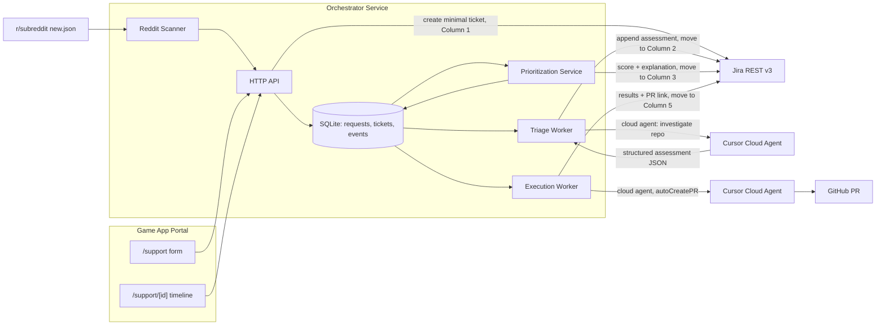

# Enterprise Workflow Prototype on Memory Palace — Master Plan

Build an enterprise engineering-workflow platform (intake → Cursor SDK triage → prioritized queue → Cursor SDK execution → GitHub PR) on top of the Memory Palace game, with real Jira and Reddit integrations and interview-ready design docs and diagrams. A plug-and-play setup wizard is documented as a future extension, not built.

## Phase status

- [ ] Phase 0 — Foundation: orchestrator scaffold, SQLite schema, Jira client, board columns, reconciliation loop
- [ ] Phase 1 — Raw intake: /support portal, store submission unchanged, create minimal Jira ticket in Column 1, trigger async triage
- [ ] Phase 2 — Triage worker: cloud agent investigation, structured assessment appended to same Jira ticket, move to Triaged
- [ ] Phase 3 — Prioritization: watch Triaged, deterministic score + explanation to Jira, move eligible to Ready for Execution
- [ ] Phase 4 — Execution worker: cloud agent with autoCreatePR from raw request + assessment, results to ticket, move to PR / Human Review
- [ ] Phase 5 — Reddit scanner: poll test subreddit, classify, dedupe, inject into intake
- [ ] Phase 6 — Design doc (with setup wizard as future extension), mermaid diagrams, 20-minute demo runbook with fallback data

## What exists today (from repo inspection)

- Memory Palace is a client-first Next.js 16 / React 19 app: pages in `app/`, game logic in `lib/` + `store/gameStore.ts`, persistence entirely in the browser (IndexedDB/localStorage). No DB, no auth, no ticketing.
- One server precedent: `app/api/generate-card-image/route.ts` (OpenAI proxy) — the pattern to follow for new API routes.
- Repo is on GitHub at `dkav1122/memory-palace` — Cloud Agents with `autoCreatePR` are viable.
- No Jira/GitHub/Cursor SDK code anywhere; the workflow layer is 100% greenfield.

## Architecture decision

Two components, one repo:

1. **Portal (thin)** — new pages inside the game app: `/support` (submit @bug/@incident/@feature) and `/support/[id]` (status timeline). They call the orchestrator's HTTP API. The game stays untouched otherwise.
2. **Orchestrator (the product)** — a standalone TypeScript service in `orchestrator/` with its own `package.json`: Hono HTTP API + SQLite (`better-sqlite3`) + a reconciliation loop. It owns the ticket store, drives Cursor SDK cloud agents (`@cursor/sdk`), and talks to Jira and Reddit. Everything reads a `workflow.config.json` (target repo, Jira project, subreddit, model) — this is what makes the "plug into any codebase" extension real rather than a slide.

**Trigger model: push-first, loop as safety net.** Most hops are direct calls the orchestrator makes itself, so no inbound webhooks are needed: intake POST triggers triage immediately in-process; agent completion is observed by `await run.wait()` (the launcher and reactor are the same process) and chains straight into the Jira update + column transition. The reconciliation loop covers only what events cannot: (a) the execution gate — starting work depends on global queue state (rank + WIP limit), not a single event; (b) recovering tickets stranded mid-pipeline by a crash or failed run; (c) Reddit, which has no webhooks and must be polled. Inbound webhooks (Jira board moves as a human approval gate, GitHub PR review feedback looping back to an agent) are documented as future extensions — they also require a public endpoint (tunnel), which is demo fragility we deliberately avoid.

**One Jira ticket per request, created at intake and enriched in place.** The Jira board is the visible state machine — every stage moves the same ticket across columns:

| Internal status          | Jira board column               |
| ------------------------ | ------------------------------- |
| `submitted` / `triaging` | Column 1: New / Awaiting Triage |
| `triaged`                | Column 2: Triaged               |
| `ready`                  | Column 3: Ready for Execution   |
| `executing`              | Column 4: In Progress           |
| `pr_ready`               | Column 5: PR / Human Review     |

(+ `rejected`, `failed` internally). The original submission is stored unchanged in SQLite (`requests.raw_submission`) and never mutated; triage and execution results are appended alongside it. Every transition writes an event row that powers the user-facing timeline (the "send the user updates" requirement) and mirrors to the Jira ticket as a comment + column transition.

## Delivery model: one phase per PR

This master plan is executed **one phase at a time**, never as a single batch. Each phase follows the same cycle:

1. **Phase plan doc** — before any code, write `docs/phases/phase-N-<slug>.md` for that phase only: concrete file-by-file scope, API/schema contracts, prompts (for agent phases), validation checklist, and explicit non-goals. The owner approves it.
2. **Implement** — on a fresh branch `phase-N-<slug>` cut from the latest `main`, containing only that phase's changes plus its plan doc.
3. **PR + review** — open a PR; the phase's validation checklist (from the plan doc) is run and results reported in the PR description.
4. **Owner merges** — the next phase does not start until the previous one is merged, since each phase builds on the merged state.

Phase 0 (foundation) is the first PR in this cycle; it is intentionally small (scaffold + Jira client + board setup) so review is quick. This master plan stays the source of truth for scope; the per-phase docs are the execution contracts.

## Phases

### Phase 0 — Foundation

- **Purpose:** scaffold so every later phase only adds a worker.
- **Build:** `orchestrator/` package (Hono, better-sqlite3, `@cursor/sdk`, tsx); SQLite schema (`requests` with immutable `raw_submission`, `tickets`, `events`); shared types in `orchestrator/src/types.ts`; a Jira client module (REST v3, API-token basic auth) with create/comment/transition helpers, since intake needs Jira from Phase 1 on; `workflow.config.json` + `.env.example` (`CURSOR_API_KEY`, `JIRA_BASE_URL`, `JIRA_EMAIL`, `JIRA_API_TOKEN`); `orchestrator dev` script running API + reconciliation loop. One-time Jira setup: board with the five columns (New / Awaiting Triage, Triaged, Ready for Execution, In Progress, PR / Human Review) and matching workflow statuses; transition IDs discovered via the transitions endpoint and cached in config.
- **Validate:** service boots, health endpoint responds, DB file created, Jira client can create + transition a test issue across all columns.

### Phase 1 — Raw intake + immediate Jira ticket

- **Purpose:** step 1 — capture the submission verbatim, make it visible in Jira instantly, and kick off async triage.
- **Build:** `POST /api/requests` stores the original submission unchanged, immediately creates a **minimal** Jira ticket (type tag, title, raw description, submitter, source) in **Column 1: New / Awaiting Triage**, stores the issue key, and marks the request eligible for the async triage worker — the API responds as soon as the row + Jira ticket exist, never blocking on agents. `GET /api/requests/:id` powers the timeline. Portal UI: `app/support/page.tsx` form (@bug/@incident/@feature, title, description, submitter name/contact — no auth, matching the app) and `app/support/[id]/page.tsx` polling timeline, styled to match the game.
- **Depends on:** Phase 0. **Validate:** submit from browser → raw row in DB + Jira ticket visible in Column 1 within seconds → timeline shows "submitted, awaiting triage".

### Phase 2 — Triage agent (Cursor SDK #1)

- **Purpose:** step 2 — investigate the request against the codebase and enrich the existing ticket (never create a second one).
- **Build:** async worker claims `submitted` requests and runs a **cloud** agent against `dkav1122/memory-palace` (`Agent.create` with `cloud: { repos: [...] }`, no PR). Prompt demands a fenced JSON assessment: severity, confidence, affected users, reproduction details, suspected root cause, relevant files, complexity, evidence, and proposed fix. Parse with a tolerant extractor + one retry on malformed output; log `agent.agentId`/`run.id` on every send. **Append** the assessment to the same Jira ticket (formatted comment + updated description/fields) and transition it to **Column 2: Triaged**. Distinguish `CursorAgentError` (never ran → retry) from `result.status === "error"` (ran and failed → mark `failed`, ticket stays in Column 1 with a failure comment).
- **Depends on:** Phase 1. **Validate:** the Column 1 ticket gains a structured triage assessment and moves to Column 2; SQLite holds the parsed fields; timeline shows `triaged`.

### Phase 3 — Prioritization service

- **Purpose:** step 3 — watch for tickets entering Triaged, score deterministically, and gate flow into execution.
- **Build:** scheduler tick watches for `triaged` tickets; pure scoring function `score(assessment)` (weights: type incident > bug > feature; severity; affected users; confidence; complexity penalty; age boost) with a unit-testable table of cases. Updates Jira with the priority field, numeric score, and a human-readable explanation of how the score was derived (comment), then transitions **eligible** tickets to **Column 3: Ready for Execution** — a WIP limit (e.g. max 1–2 in execution) holds the rest in Triaged so the queue is the backpressure mechanism. `GET /api/queue` exposes the ranked queue (demo-friendly).
- **Depends on:** Phase 2. **Validate:** three tickets of differing severity order correctly with visible score explanations in Jira; WIP limit visibly holds one back in Column 2.

### Phase 4 — Execution agent + PR (Cursor SDK #2)

- **Purpose:** steps 4–5 — implement and validate the change, produce a human-reviewable PR, close the loop to the submitter.
- **Build:** worker picks the next eligible ticket from Ready for Execution, transitions it to **Column 4: In Progress**, and launches a cloud agent with `autoCreatePR: true` and `skipReviewerRequest: true`. Prompt is assembled from the **original raw submission + the full triage assessment** (repro, root cause, relevant files, proposed fix) with guardrails: minimal diff, no unrelated refactors, validate the change (build/lint) before finishing. Capture the PR URL from the result, append execution results (summary, PR link, validation outcome) to the Jira ticket, and transition it to **Column 5: PR / Human Review**; write the `pr_ready` timeline event. On failure: return the ticket to Ready for Execution with an attempt count and a failure comment.
- **Depends on:** Phase 3. **Validate (end-to-end milestone):** file a real request in the game UI → one Jira ticket travels Column 1 → 2 → 3 → 4 → 5 → open PR on GitHub linked from both the user timeline and the Jira ticket.

### Phase 5 — Reddit intake

- **Purpose:** step 6 — external community signal feeds the same pipeline.
- **Build:** the owner creates a test subreddit and seeds 3–5 posts; scanner polls `https://www.reddit.com/r//new.json` (descriptive User-Agent, respect rate limits), dedupes by post id (`seen_posts` table), classifies each post as bug/incident/feature/ignore (cheap heuristic first; a one-shot `Agent.prompt` classifier if quality demands it), and injects qualifying posts through the same intake endpoint with `source: reddit` and a permalink. From there the pipeline is identical.
- **Depends on:** Phase 2 (reuses intake + triage). **Validate:** seeded Reddit post appears as a ticket with Jira issue; duplicate scan produces nothing new.

### Phase 6 — Design doc, diagrams, demo runbook

- **Build:** `docs/WORKFLOW-DESIGN.md` (problem statement, behavior, decisions — cloud vs local agents, SQLite queue vs message broker, deterministic scoring vs LLM prioritization, Jira-mirror vs Jira-source-of-truth — and limitations); mermaid diagrams (end-to-end system, triage sequence, execution sequence, ticket state machine); `docs/DEMO.md` runbook with a scripted 20-minute flow plus pre-seeded fallback data in case a live cloud agent is slow mid-demo.
- **Future extensions section (not built, presented in the design doc):**
  - **Plug-and-play setup wizard** — the "special next step": an interactive CLI (`orchestrator setup`) prompting for GitHub repo, Jira base URL/project key, subreddit, and Cursor model (validated via `Cursor.models.list()`), verifying credentials with live checks, and writing `workflow.config.json`. Credible because the groundwork ships in Phase 0: every worker already reads `workflow.config.json` instead of hardcoded values, so the wizard is purely additive. This is also a natural candidate for the live-extension portion of the interview.
  - Inbound webhooks: Jira board moves as a human approval gate; GitHub PR review feedback looping back to an agent.
  - Auth / real user identity on the intake portal; email or Slack notifications alongside the in-app timeline.

## Assumptions and unknowns to resolve early

- **Cursor GitHub app** must be installed on `dkav1122/memory-palace` and the owner's personal `CURSOR_API_KEY` must have repo access — verify in Phase 0, it blocks Phases 2 and 4.
- **Jira:** need the site URL, a project key, and an API token. The board must be configured once with the five workflow columns (New / Awaiting Triage, Triaged, Ready for Execution, In Progress, PR / Human Review); the orchestrator discovers transition IDs via the Jira transitions endpoint rather than hardcoding them.
- **Structured output:** cloud agents have no JSON mode — mitigated by prompt discipline, tolerant parsing, one retry (Phase 2).
- **Demo latency:** cloud agent runs take minutes; the runbook stages a pre-triaged ticket so the demo never stalls.
- **No auth** in the game app: submitter is self-reported name/contact; noted as a deliberate scope cut in the design doc.
